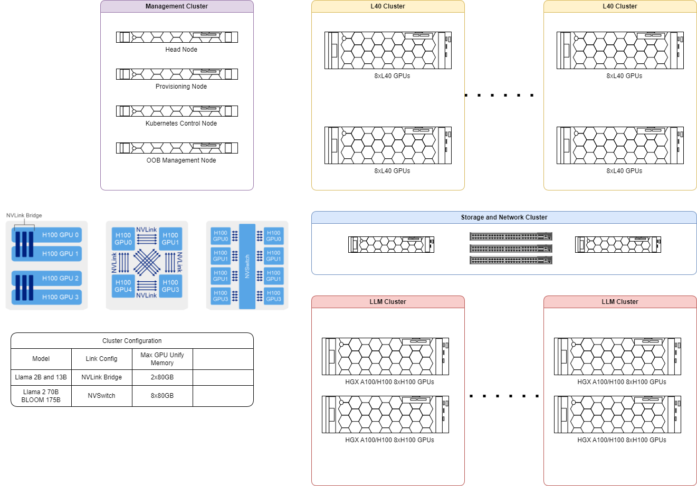

## Inference Infrastructure setup
Below shows the diagram of a reference infrastructure for inferenced

It consists of 4 main clusters:
1. Management Cluster
2. Compute Clusters
3. Storage and Networking function. 

## Management Clusterr

The management cluster consists of Head Node, Provisioning Node, Kubernetes Control Node and OOB Management Node

## Compute Clusters

Depending on the type of inference models and the performance requriement. These clusters consist of multiple compute nodes and it can be scale up and scale down according to the compute demand.

